# Liquidity voids, order-flow imbalance and inventory recycling on BTC perpetuals

*A replication and a pre-registered strategy test on live public data from Binance, Bybit and OKX, 2 October 2026.*

## Abstract

We set out to test two published accounts of how limit order books move prices. We then tried to turn them into a trading strategy, using mechanics of our own built into a deterministic Rust engine.

**The papers.**

- **Cont, Kukanov and Stoikov** (2014; preprint 2010): price changes are linear in order-flow imbalance (OFI) at the best quotes, with a slope inversely proportional to depth.
- **Farmer, Gillemot, Lillo, Mike and Sen** (2004): large price changes are driven by gaps and fluctuations in order-book liquidity, not by large orders.

**Our mechanics.**

- liquidity voids with a formation, departure and revisit lifecycle
- revisit-gated passive entries in fixed inventory quanta, recycled through a central inventory rule
- a multi-venue composite price reference
- an L2 queue simulator bounded by three cancellation models
- a stale-touch rule and a pick-off filter

**Data and method.** Five recorded sessions, 1.4 hours in total, every one replaying exactly. We pre-registered the main strategy test and ran it on a one-hour holdout session.

**Findings.**

- **The Cont–Kukanov–Stoikov result replicates closely.** OFI explains 47–61% of one-second and 62–67% of ten-second price variance, against 11–21% for trade imbalance. The impact coefficient scales with depth with a log-slope of −0.87 to −1.09, against their predicted −1.
- **Farmer et al. replicate in part.** Book flow explains the size of price moves two to four times better than traded volume, and the largest moves rarely come from a single large order. But BTC books have no gaps to speak of (median first gap: one tick), so the largest one-second moves are flurries of small orders, totalling several times the touch.
- **The strategy fails.** Void-revisit-gated round trips were indistinguishable from an ungated control: −45.8 versus −46.9 USDT per BTC per round trip, with a difference of +1.1 (95% CI −27.5 to +29.5). The pre-registered hypotheses H1–H3 all fail.

**Alternatives.** Four alternatives were tested afterwards, as exploratory work: loosened entries, momentum after large candles, cross-venue gaps and funding carry. None clears retail fees. A pick-off filter, which skips quoting a venue's stale side, halves adverse selection. It is the one lead that a market-maker rebate tier could make viable; that needs its own pre-registered test.

No order was ever sent; all fills are simulated against recorded public order books.

## 1. Background and what we added

**Order-flow imbalance (Cont, Kukanov & Stoikov 2014).** CKS define OFI from changes in the best bid and ask, combining size and price. Over short intervals, the mid-price change is approximately linear in OFI: ΔP ≈ β·OFI, with β ≈ c/D, where D is the depth at the best quotes. They found OFI explains far more of the price variance than trade imbalance (TI), which counts trades alone. The engine's order-flow layer implements their best-quote definition exactly (`orderflow::best_quote_ofi`, [Phase 5](../phase5.md)). The replication uses that production function, not a re-implementation.

**What really causes large price changes (Farmer et al. 2004).** Studying London Stock Exchange order books, they found large price changes are not caused by large orders. They come from fluctuations in liquidity: when an order removes the best level, the price jumps by the gap behind it, and gaps vary enormously. That view of liquidity "voids" is the premise of this engine's specification.

**Our mechanics, layered on both.** The specification asked for a strategy that harvests price revisits to liquidity voids while recycling inventory. To build and test it we added:

- **Void lifecycle.** A cell-based depth baseline on a common price grid. A void forms when depth falls below a fraction of baseline, persists for a minimum time, and is registered when price leaves it. A revisit or partial penetration counts; a second full traversal is not required. Calibration added a "suspend" mode for voids that leave the visible order-book window.
- **Inventory quanta and recycling.** Fixed 0.001 BTC children, opened only on an allowed revisit in a qualifying environment and closed by take-profit or age-triggered rebalancing. A central rule allows a close that is profitable after costs, or one that improves the projected inventory balance. Hard limits and a latched kill switch sit on top.
- **Composite multi-venue reference.** A weighted mean of venue midpoints. Venues cross each other routinely, so the consolidated touch is often unusable.
- **Execution simulation.**
  - an L2 queue model bounded by pessimistic, proportional and optimistic cancellation attribution
  - exact ppm fee schedules
  - a stale-touch rule (no quote at a price a print has already traded through)
  - markouts split into captured spread and drift
  - an entry objective J(a) that values queue position
- **Controls and pre-registration.** An ungated control with identical exits, and hypotheses committed to git before the holdout was replayed.

## 2. Data

| Session | Length | Role | Notes |
|---|---:|---|---|
| A | 58.6 s | training | Rising market |
| B | 294.6 s | training | One OKX reconnect |
| C | 601.1 s | training | Network-wide stall at 548 s; replays cleanly to the end |
| D | 600.2 s | exploratory | The only short session with multi-venue revisits |
| E | 3,600.4 s | pre-registered holdout | Price left the research corridor after about 12 min |

**What was recorded.** BTC/USDT linear perpetuals on Binance USDⓈ-M, Bybit and OKX: public WebSocket feeds, top-20 depth windows and trades, stamped on one local monotonic clock. The live engine's inventory journal was recorded alongside.

**Verification.** All sessions replay to the identical engine state and journal: 888, 4,134, 8,339, 8,266 and 49,159 commands. The recordings stay outside the repository under exchange terms; their SHA-256 checksums are in [`docs/evidence/recordings.sha256`](../evidence/recordings.sha256).

**Funding test data.** One year of public funding-rate history for Binance and Bybit, and the roughly three months OKX publishes.

## 3. Methods, against current practice

| Area | Current practice in the literature | This study |
|---|---|---|
| Order-flow measurement | Best-quote OFI (Cont et al. 2014); multi-level OFI (Xu, Gould & Howison 2019) | Best-quote OFI from the production engine. Multi-level OFI is not implemented. |
| Queue position and fills | Queue-reactive models estimate order-arrival and cancellation intensities as functions of queue size (Huang, Lehalle & Rosenbaum 2015) | Bounds instead of a model: three cancellation-attribution rules, with a fill only on a print at our price after the queue ahead, or through it. No intensity model was fitted. |
| Adverse selection | Markouts at several horizons; realized-spread and price-impact decomposition (Glosten & Milgrom 1985 for the theory) | Ten horizons from 1 ms to 5 s, an exact spread/drift split, and an unconditional volatility control. |
| Stale data | Latency-aware simulation | Stale-touch rule; constant order latency of 0, 50 or 200 ms in the fill study. Engine orders have zero latency. |
| Market-making policy | Optimal quoting with inventory risk (Avellaneda & Stoikov 2008; Guéant, Lehalle & Fernandez-Tapia 2013) | A rule-based policy plus a transparent utility J(a). Optimal-control quoting is not implemented. |
| Inference on dependent data | HAC standard errors (Newey & West 1987); block bootstrap (Künsch 1989) | Newey–West for every regression; moving-block bootstrap for the strategy comparisons. |
| Research integrity | Pre-registration and holdouts (Nosek et al. 2018); multiple-testing awareness (Harvey, Liu & Zhu 2016) | H1–H3 committed before the holdout was replayed (commit `94dbd07`). A crash found during the test is reported both as registered and as fixed. Everything after the test is labelled exploratory. |

**Where we are below current practice:**

- no queue-reactive intensity model
- no multi-level OFI
- constant latency
- no optimal-control quoting

Each is a direction for future work, not a hidden assumption.

## 4. Results

### 4.1 Cont, Kukanov & Stoikov replicate

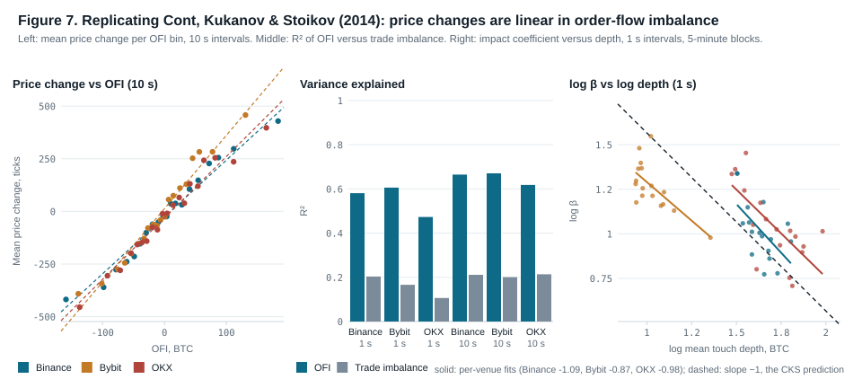

| Venue | Interval | β, ticks per BTC of OFI | Newey–West t | R², OFI | R², TI | R², both | log-depth slope |
|---|---|---:|---:|---:|---:|---:|---:|
| Binance | 1 s | 2.78 | 38.2 | 0.581 | 0.204 | 0.659 | −1.09 ± 0.42 |
| Bybit | 1 s | 3.51 | 44.2 | 0.606 | 0.166 | 0.640 | −0.87 ± 0.12 |
| OKX | 1 s | 2.88 | 43.3 | 0.473 | 0.106 | 0.516 | −0.98 ± 0.27 |
| Binance | 10 s | 2.70 | 15.6 | 0.665 | 0.211 | 0.765 | −1.78 ± 0.57 |
| Bybit | 10 s | 3.48 | 25.2 | 0.671 | 0.201 | 0.731 | −0.66 ± 0.30 |
| OKX | 10 s | 2.92 | 23.1 | 0.618 | 0.214 | 0.693 | −1.03 ± 0.17 |

**All three of CKS's results hold on crypto perpetuals.**

- **Price change is linear in OFI.** At 10 s, R² is 0.62–0.67, the same order as the roughly 65% average they report for US equities.
- **OFI explains far more than trade imbalance** (TI): 2.8 to 4.5 times as much at 1 s, and about 3 times at 10 s.
- **Impact is proportional to 1/depth.** At 1 s, the slopes of −0.87 to −1.09 bracket their −1; each figure is the slope of log β across 17 five-minute blocks of a session. The 10 s slopes are noisier, with 30 intervals per block.

**The trading question CKS did not ask.** Does this interval's OFI predict the next interval's price change?

- **At 1 s, yes, significantly:** R² 1.1–3.1%, t 6.9–12.9. But the strongest OFI decile is followed by only 9.5–25.9 ticks (1.0–2.6 USDT per BTC), against 86.6 USDT of taker round-trip fees.
- **At 10 s it is not significant:** t from 1.0 to 2.0.

The relationship is real and contemporaneous, not a tradable forecast at retail fees.

### 4.2 Farmer et al. replicate in part

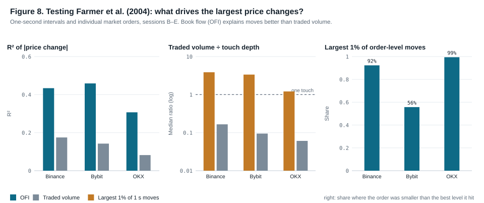

| One-second intervals | Binance | Bybit | OKX |
|---|---:|---:|---:|
| R², \|move\| on \|OFI\| (book flow) | 0.434 | 0.459 | 0.307 |
| R², \|move\| on \|traded volume\| | 0.175 | 0.142 | 0.082 |
| Largest 1% of moves: threshold | 27.3 USDT | 27.2 USDT | 27.7 USDT |
| Traded volume ÷ touch depth, largest moves (median) | 3.86 | 3.36 | 1.21 |
| Traded volume ÷ touch depth, all intervals (median) | 0.17 | 0.09 | 0.06 |

| Individual market orders | Binance | Bybit | OKX |
|---|---:|---:|---:|
| Orders | 182,903 | 83,263 | 180,569 |
| Largest 1% of moves: order smaller than the best level it hit | 92% | 56% | 99% |
| Median first gap behind the best level, largest moves vs all | 1 vs 1 tick | 1 vs 1 tick | 1 vs 1 tick |

**What holds.** Book flow, which includes cancellations and new quotes, explains move size two to four times better than traded volume. At the order level, the largest moves almost never coincide with one order large enough to clear the best level. Price moves are a liquidity phenomenon, as Farmer et al. argue.

**What differs.** Their gap mechanism needs gaps, and BTC perpetual books are dense: the median first gap is one tick (0.1 USDT) for large and ordinary moves alike. The largest one-second moves arrive as flurries of small orders whose combined volume exceeds the touch 1.2–3.9 times. Thin books are the setting their mechanism comes from; a deep, continuously replenished BTC book is a different regime.

**Measurement limits.**

- Binance and OKX depth arrives every 100 ms and Bybit every 20 ms, so the "book before the order" can be up to that stale.
- Binance trade messages aggregate fills.

The order-level figures should be read with that resolution in mind; the Bybit figures are the cleanest.

### 4.3 Passive fills at the touch, and the pick-off filter

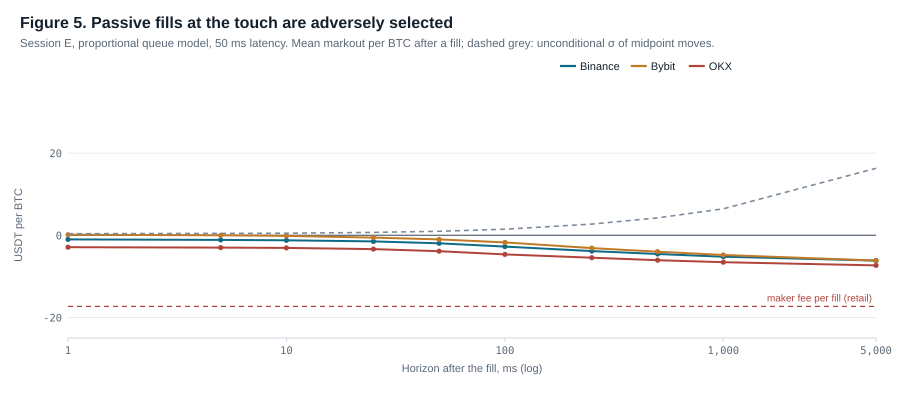

The fill study keeps one passive probe per side at every venue's touch, under all four fill models, at 0, 50 and 200 ms latency.

- **Across all four sessions and three venues, fills are adversely selected.** The price drift 1 s after a fill is −41 to −66 ticks: 0.6–0.7 of an ordinary 1 s move, against the probe.
- **The fee is bigger still.** The retail maker fee is 173 ticks, 17.3 USDT per BTC per fill.

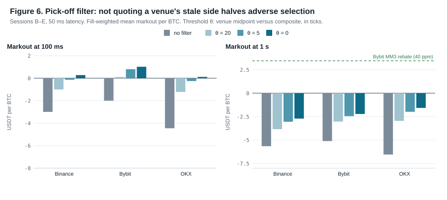

**Pick-off filter (exploratory).** Binance and OKX fills land when that venue's price lags the composite of the other venues. The filter does not quote a bid while the venue sits above the composite (a stale-high venue's bid is about to be hit), and mirrors this for asks.

| Threshold | 100 ms markout (Binance / Bybit / OKX) | 1 s markout | Fills kept |
|---|---|---|---|
| Off | −3.0 / −2.0 / −4.5 USDT per BTC | −5.7 / −5.1 / −6.6 | 100% |
| θ = 0 | +0.3 / +1.0 / +0.1 | −2.7 / −2.2 / −1.6 | 45 / 56 / 33% |

The filter halves the 1 s adverse markout and makes 100 ms markouts slightly positive. The gain is in the price at the fill; the drift afterwards is unchanged.

**At retail fees it still loses** about 19 USDT per BTC per fill. **With a market-maker rebate it might not.** Bybit's MM3 tier pays 40 ppm (about 3.5 USDT per BTC), more than Bybit's filtered 1 s markout of −2.2. This is the study's one open lead. It was found after the main test, with the threshold chosen in-sample, so it needs a pre-registered test of its own.

### 4.4 The pre-registered strategy test fails

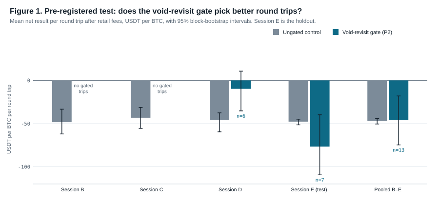

**Design.** The void-revisit-gated strategy (variant P2) faces an ungated control with identical exits: take profit at +450 ticks (round-trip maker fees plus measured drift plus a margin), otherwise leave at the touch after 60 s. Both use retail fees and the proportional queue model.

**Hypotheses, committed before the holdout was replayed.**

- **H1:** the gate beats the control.
- **H2:** the gated strategy is profitable.
- **H3:** the H1 difference has the same sign in sessions D and E.

| USDT per BTC per round trip, 95% CI | Control | Gated | Gated minus control |
|---|---|---|---|
| Session D (exploratory) | −45.8 [−59.5, −37.6] | −9.8 [−35.3, +10.8], n = 6 | +36.0 [+9.2, +62.2] |
| Session E (holdout) | −47.7 [−51.5, −44.9] | −76.7 [−109.4, −39.8], n = 7 | −28.9 [−62.1, +7.9] |
| Pooled B–E | −46.9 [−50.5, −44.2] | −45.8 [−74.7, −18.0], n = 13 | +1.1 [−27.5, +29.5] |

**H1, H2 and H3 all fail.** Session D's encouraging difference reversed in the holdout.

**As registered, the strategy replay crashed at 714 s of E.** A bug in the new `suspend` mode made an out-of-view void's revisit fail. The as-registered and the fixed results are both reported in [calibration.md](../calibration.md), and the verdict is the same.

**On the intervals.** Control intervals use a moving-block bootstrap, because its trips share one price path. Consecutive trips turned out *negatively* correlated, as long and short cyclers offset each other, so the plain standard error was conservative, not optimistic.

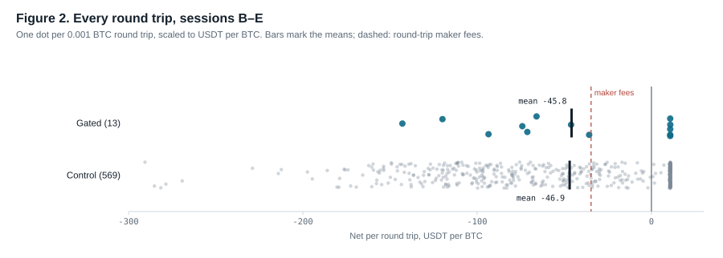

The take-profit cluster (+10.8 USDT per BTC after fees) is identical for both groups. The losses come from 60 s exits after the price moved away, and the gate does not avoid them.

### 4.5 Loosening the entry only multiplies the loss

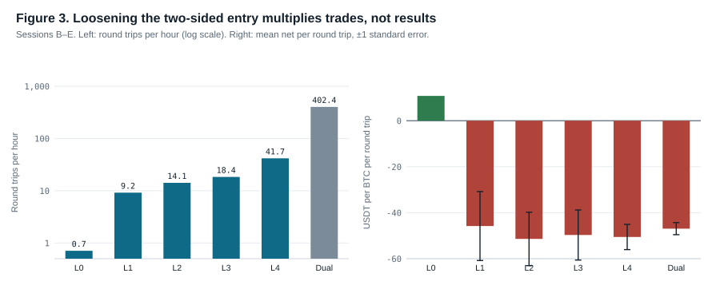

From the shipped scopes to quoting both sides whenever flat, round trips rise from 0.7 to 402 per hour. The loss per round trip stays at −46 to −51 USDT per BTC. A looser two-sided entry is detrimental at retail fees.

### 4.6 Why so few gated trades: observability

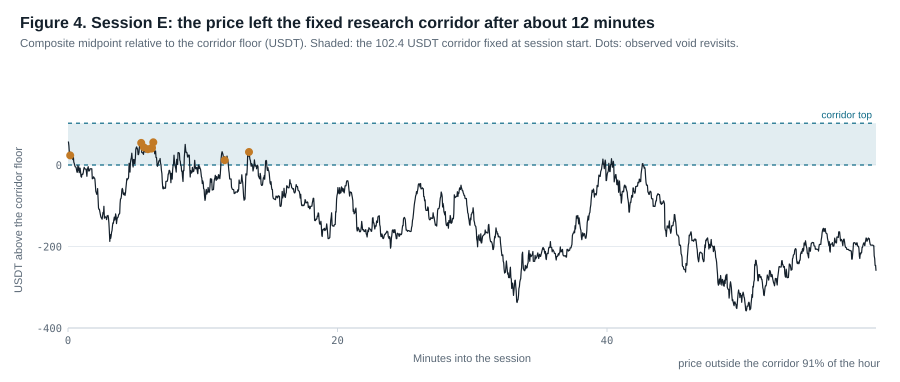

Two limits of the data and engine, not of the strategy idea, capped the number of gated trades:

1. **Top-20 windows.** Each venue shows only its top 20 levels, about ±2 USDT on BTC. Under Phase 4 rules a void the price leaves goes out of view within ticks and is invalidated. The `suspend` mode fixes the invalidation, but a void still has to stay within the visible band.
2. **A fixed research corridor.** The corridor is 102.4 USDT, fixed at session start. In E the price was outside it 91% of the hour; all 28 revisits came in the first 15 minutes.

The strategy was therefore tested on about 15 minutes of E. Deeper books (Bybit offers 200 levels, OKX 400) and a re-centring corridor are the prerequisites for a better-powered test.

### 4.7 Alternatives (exploratory)

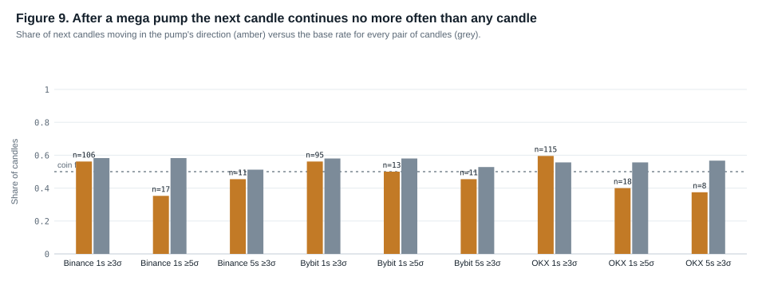

**Momentum after a mega pump.** A pump is a candle of at least 3σ or 5σ of the previous 120 candles.

- **Frequency:** 3σ one-second pumps occur 67–81 times an hour per venue.
- **Continuation:** the next candle continues 56–60% of the time, the same as the 56–58% base rate for any candle. After 5σ pumps it continues *less* often (35–50%).
- **Duration:** a continuation lasts about 2 s and runs 11–16 USDT per BTC, far below the 87 USDT of taker round-trip fees.

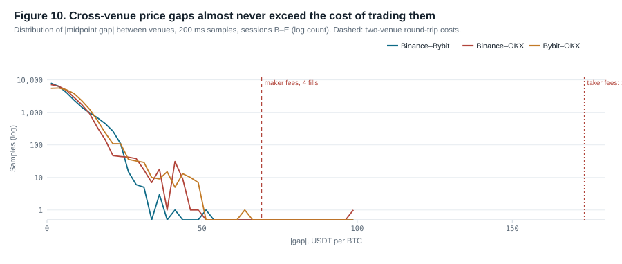

**Cross-venue gaps.** The median gap between venue midpoints is 4–6 USDT per BTC and the 99th percentile 21–23. The gap exceeded the 69 USDT cost of a maker round trip on two venues in one sample out of about 74,000. It never exceeded the 173 USDT taker cost.

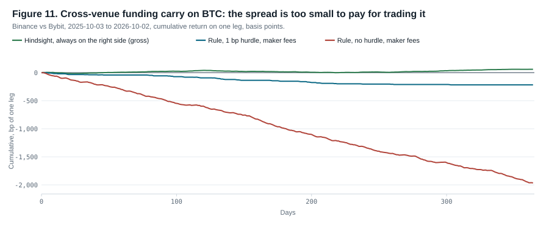

**Funding carry.** Over a year, BTC funding spreads between Binance and Bybit averaged 0.34 bp per 8 h (0.25–0.28 bp for the OKX pairs). Even with hindsight, the best static position earns 0.6–0.9% a year gross on one leg. Every rule that trades loses after fees. BTC funding is tightly arbitraged; altcoins might differ.

## 5. Discussion

The two papers' mechanisms are visible in this data, and both are contemporaneous: they describe how prices move as order-book events happen, not what will happen next.

The strategy needs a forecast large enough to pay fees. At retail fees that hurdle is:

- about 35 USDT per BTC for a maker round trip
- about 87 for a taker round trip

The only forecast we found that comes close is avoiding fills on a venue's stale side, and it falls short at retail fees. **The binding constraint is fee tier, not pattern.** A market-maker programme's negative fees change the arithmetic for the pick-off-filtered maker. Nothing else tested here comes close.

## 6. Limitations

- **Little data.** About 1.4 hours of one asset, and roughly 15 minutes of usable strategy time in the holdout.
- **Simulated fills.** Queues are inferred from 20 public levels; hidden and iceberg liquidity and our own market impact are absent; children fill atomically.
- **Latency.** Constant in the fill study; zero inside the engine.
- **Composite reference.** It is itself noisy at 1 ms, with σ of 0.46–0.77 USDT, because venues update at different instants.
- **No holdout for the follow-ups.** The loosening, momentum, pick-off, gap and funding tests were run after the main test and are exploratory.
- **Funding data.** OKX publishes only about three months of funding history.

## 7. Reproducibility

Every number and figure here is regenerated from the recordings by committed code. `$RECORDINGS` is a directory of `session-A` … `session-E` recordings (not published; record your own with `lre live-record`), and `$EVIDENCE` is its parent:

```sh
cargo build --release -p cli --locked
python3 scripts/momentum.py     $RECORDINGS docs/evidence/momentum.json
python3 scripts/build-evidence.py $RECORDINGS
python3 scripts/replications.py $RECORDINGS
python3 scripts/pickoff.py      $RECORDINGS
python3 scripts/funding.py      $EVIDENCE --offline
python3 scripts/robustness.py
python3 scripts/figures.py
python3 scripts/render-evidence.py
```

The engine is Rust (stable, `unsafe` forbidden, integer money, zero allocations after start-up) with 160 tests. Analysis scripts use the Python standard library only. Pre-registration: commit `94dbd07`; results: `00cc725`. An interactive version of this evidence is published at [https://astralchemist.github.io/liquidity-recycling-engine/evidence/](https://astralchemist.github.io/liquidity-recycling-engine/evidence/), built from [`docs/evidence/index.html`](../evidence/index.html).

## References

- Avellaneda, M., & Stoikov, S. (2008). High-frequency trading in a limit order book. *Quantitative Finance*, 8(3), 217–224.
- Cont, R., Kukanov, A., & Stoikov, S. (2014). The price impact of order book events. *Journal of Financial Econometrics*, 12(1), 47–88. Preprint arXiv:1011.6402 (2010).
- Farmer, J. D., Gillemot, L., Lillo, F., Mike, S., & Sen, A. (2004). What really causes large price changes? *Quantitative Finance*, 4(4), 383–397.
- Glosten, L. R., & Milgrom, P. R. (1985). Bid, ask and transaction prices in a specialist market with heterogeneously informed traders. *Journal of Financial Economics*, 14(1), 71–100.
- Guéant, O., Lehalle, C.-A., & Fernandez-Tapia, J. (2013). Dealing with the inventory risk: a solution to the market making problem. *Mathematics and Financial Economics*, 7(4), 477–507.
- Harvey, C. R., Liu, Y., & Zhu, H. (2016). … and the cross-section of expected returns. *Review of Financial Studies*, 29(1), 5–68.
- Huang, W., Lehalle, C.-A., & Rosenbaum, M. (2015). Simulating and analyzing order book data: The queue-reactive model. *Journal of the American Statistical Association*, 110(509), 107–122.
- Künsch, H. R. (1989). The jackknife and the bootstrap for general stationary observations. *Annals of Statistics*, 17(3), 1217–1241.
- Newey, W. K., & West, K. D. (1987). A simple, positive semi-definite, heteroskedasticity and autocorrelation consistent covariance matrix. *Econometrica*, 55(3), 703–708.
- Nosek, B. A., Ebersole, C. R., DeHaven, A. C., & Mellor, D. T. (2018). The preregistration revolution. *Proceedings of the National Academy of Sciences*, 115(11), 2600–2606.
- Xu, K., Gould, M. D., & Howison, S. D. (2019). Multi-level order-flow imbalance in a limit order book. *Market Microstructure and Liquidity*, 4(3–4).
